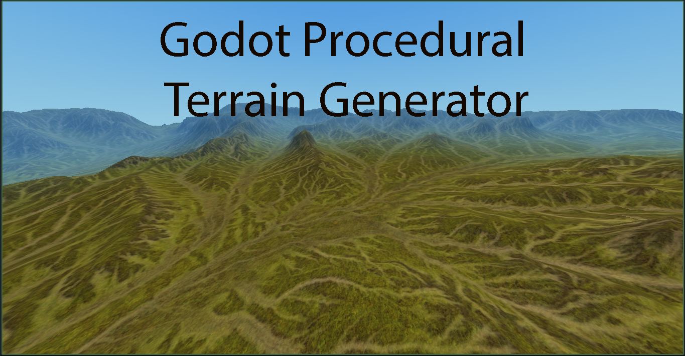
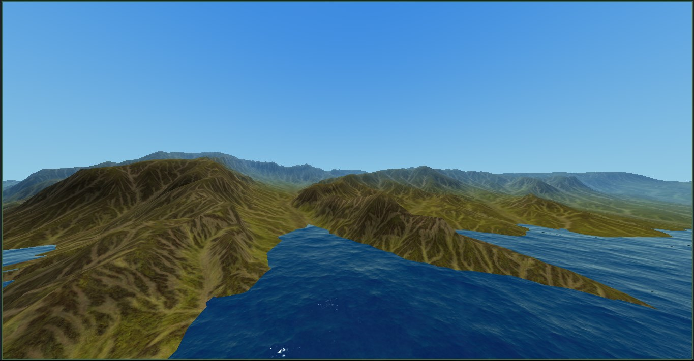
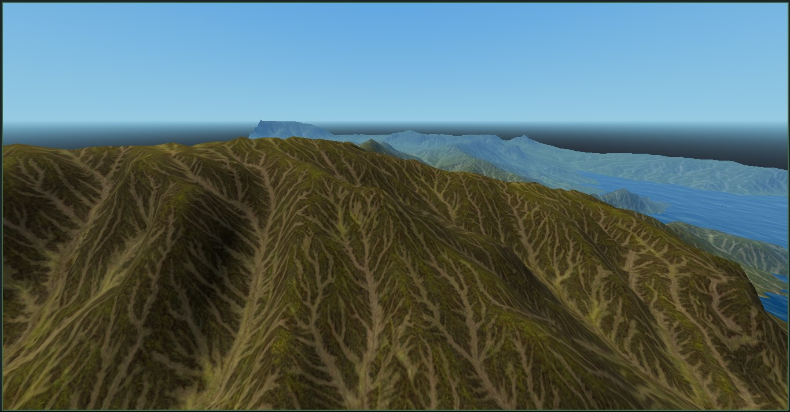
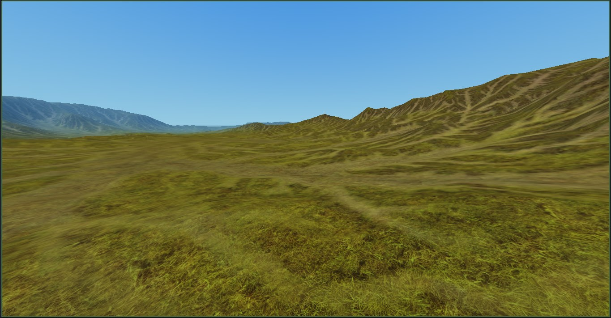
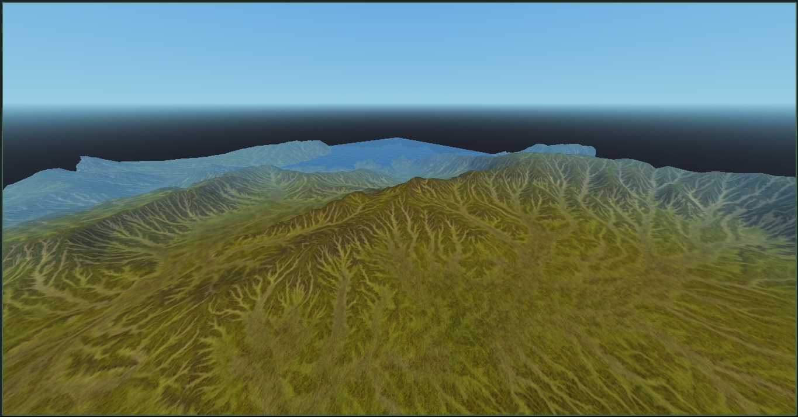

# Procedural Terrain Generator for Godot
Procedural terrain generation for Godot 4 based on MeshInstance3D and a height map. Generation is available both in the editor and during execution.

    

# Usage
1. Attach the `terrain_generator.gd` script to a **MeshInstance3D** node.
2. **Set the Heightmap:** Set height map texture (e.g., PNG, JPG, etc.).
3. Adjust the **Subdivisions** property to control the terrain detail. Be careful, as a **subdivisions value greater than the map size** may result in "steps" on the surface!
4. Configure the *data saving path* if you want to use it in the editor, and click **"Generate Landscapes"**. Now you can *generate the landscape in advance and use it without having to generate a mesh every time you run*!

Tested on Godot 4.4. It’s public domain, so use it however you want!

Heightmap taken from [here](https://ambientcg.com/view?id=Terrain004)

# Screenshots
some ugly... but cool, lol

    
    
    
    

